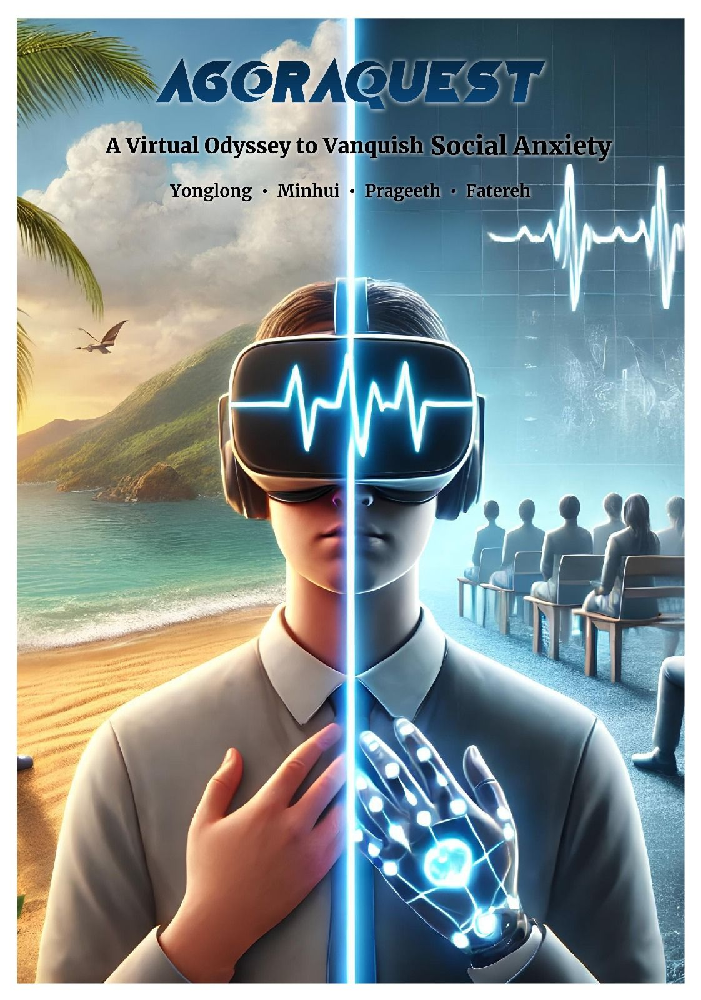

# Agoraquest-A Virtual Odyssey to Vanquish Social Anxiety.
<!-- PROJECT LOGO -->

   
   
## Introduction

Agoraquest is an educational and mental health Virtual Reality (VR) experience that lets you explore social anxiety in Virtual world. This project aims to provide a unique experience for users to overcome social pressure and anxiety by gradually adapting to the discomforts and following guided instructions when needed.

The problem detected was

The proposed solution is valuable because

   

